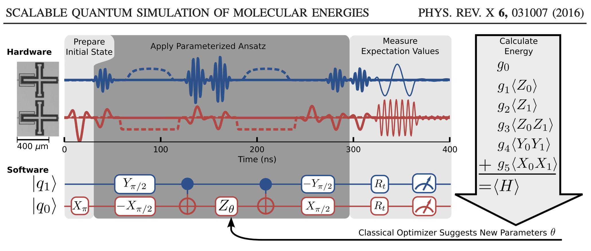

# Variational Quantum Eigensolver (VQE)

## Basics

A Variational Quantum Eigensolver (VQE for short), is a hybrid quantum classical algorithm that variationally determines the ground state energy of a Hamiltonian. It continues to guestimate the minimum eigensolver for a Hamiltonian for finding eigenvalues of a matrix.

It's quantum in the sense that the expectation value of the energy is computed via a quantum algorithm, but it is classical in the sense that the energy is minimized with a classical optimization algorithm.

From a molecular electronic structure perspective, it is equivalent to computing the Full Configuration Interaction (FCI) for a given basis.

If you're able to represent something with a Hamiltonian, and finding the minimum eigenvector means something, then we're good! And there's actually many applications that fit the bill, for example simulating molecules!

Quantum computing can be a little unintuitive, but lets see how far I can push this.

## Task Overview

The problem I want to tackle is to implement the VQE to compute the energy of molecular hydrogen (H$_2$) in a minimal basis. I will base this implementation off the really neat paper

> O’Malley, Peter JJ, et al. "[Scalable quantum simulation of molecular energies.](https://link.aps.org/doi/10.1103/PhysRevX.6.031007)" Physical Review X 6.3 (2016): 031007.
    
In the O'Malley paper, they implement the VQE on a real quantum computer to compute the potential energy surface of H$_2$. The schematic I followed can be seen below.

Here, we're finding the ground state of the molecule (the natural or real state of the molecule). Ground state means lowest energy. As it turns out, we can turn the molecule into a Hamiltonian, and finding the lowest eigenvector actually means the lowest energy state of the molecule.

## The Plan
Here's the big, overarching plan:

1. Put the Hamiltonian in the computational (qubit) basis.
2. Obtain a variational ansatz to parameterize the wave function.
3. Represent this ansatz as a quantum circuit.
4. Given this circuit, measure the expectation value of Hamiltonian (energy).
5. Vary the circuit parameters until the energy is minimized.

The quantum circuits are built using **[Qiskit](https://qiskit.org/)**. In addition, *Numpy* and *Scipy* are needed for the execution.

